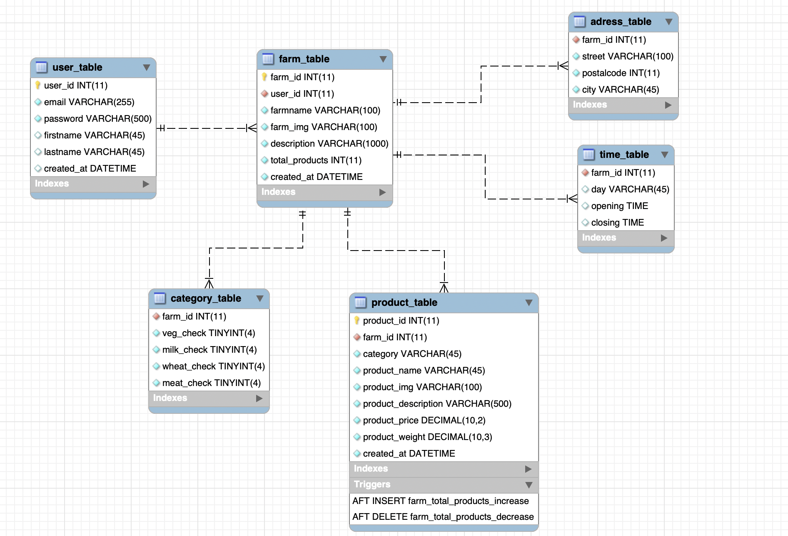

# DaLokal Website

## Description

DaLokal is a project to connect customer with farms nearby. The user is able to see which farm is selling which goods,what categories, what the farm is about (description), where the farm can be find (adress) and at which time the farm is open.
Every farmer can sign up and can edited his farm every time. The farmer can give a description about his or her farm can give it opening and closing times and can add or delete products and more. 

Farmer can signup or login. While sining up the farmer provides data about himself (firstname and lastname) and about the farm (opening hours, farmname, description etc.) after finishing that he can still edit his data (like login email or password or farm description etc.). Now the farm is displayed on the homepage for everyone. Now the farmer can add his product he want to sell (product, description, price etc.). After that every user can see his products and also the product categories the farmer provides on the homepage

## ER Diagram

Every user and every user data is connected to the database of MySQL.

* farm_table has a one relationship to user_table
* adress_table has a one relationship to farm_table
* time_table has a zero or many relationship to farm_table
* product_table has a zero or many relationship to farm_table
* category_table has a zero to many relationship to farm_table
product_table has to triggers one for AFTER INSERT and one for AFTER DELETE.

## Get started

### Online page

Hosted with gcloud
[DaLokal](https://dalokal-website.ey.r.appspot.com/?)

The DB password is locked in a github secret

### For local run

Connect MySQL database with website.
For that if not already install [MySQL Community](https://www.mysql.com/products/community/) and [MySQL Workbench](https://www.mysql.com/products/workbench/) on your pc and create a connection.
After done this go to website.py and use connection for local host and remove all #
for gcloud connection add #
- host='localhost'
- user to your MySQL connection user name (default is root)
- and if used your password after password=''

To get started and run the website on a localhost enter the following three lines in your terminal:

export FLASK_APP=dalokal_website.website.py

export FLASK_DEBUG=1

flask run

If database not setted up automatically use this queries in MySQL Workbench to create the database:
This queries should normally be run in the function on website.py createDatabase() in line 28

CREATE SCHEMA IF NOT EXISTS dalokalschema;
USE dalokalschema;

CREATE TABLE IF NOT EXISTS user_table (
    user_id INT(11) NOT NULL AUTO_INCREMENT,
    email VARCHAR(255) NOT NULL,
    password VARCHAR(500) NOT NULL,
    firstname VARCHAR(45),
    lastname VARCHAR(45),
    created_at DATETIME DEFAULT CURRENT_TIMESTAMP,
    PRIMARY KEY (user_id),
    UNIQUE KEY unique_email (email),
    UNIQUE KEY unique_user_id (user_id)
);

CREATE TABLE IF NOT EXISTS farm_table (
    farm_id INT(11) NOT NULL AUTO_INCREMENT,
    user_id INT(11) NOT NULL,
    farmname VARCHAR(100) NOT NULL,
    farm_img VARCHAR(100) NOT NULL,
    description VARCHAR(1000) NOT NULL,
    total_products INT(11) NOT NULL DEFAULT 0,
    created_at DATETIME NOT NULL DEFAULT CURRENT_TIMESTAMP,
    PRIMARY KEY (farm_id),
    UNIQUE KEY unique_farm_id (farm_id),
    UNIQUE KEY unique_farmname (farmname),
    CONSTRAINT farmToTable FOREIGN KEY (user_id)
    REFERENCES user_table(user_id)
);

CREATE TABLE IF NOT EXISTS product_table (
    product_id INT(11) NOT NULL AUTO_INCREMENT,
    farm_id INT(11) NOT NULL,
    category VARCHAR(45) NOT NULL,
    product_name VARCHAR(45) NOT NULL,
    product_img VARCHAR(100) NOT NULL,
    product_description VARCHAR(500) NOT NULL,
    product_price DECIMAL (10,2) NOT NULL,
    product_weight DECIMAL (10,3) NOT NULL,
    created_at DATETIME NOT NULL DEFAULT CURRENT_TIMESTAMP,
    PRIMARY KEY (product_id),
    UNIQUE KEY unique_product_id (product_id),
    CONSTRAINT productToFarm FOREIGN KEY (farm_id)
    REFERENCES farm_table(farm_id)
);

CREATE TABLE IF NOT EXISTS time_table (
    farm_id INT(11) NOT NULL,
    day VARCHAR(45),
    opening TIME,
    closing TIME,
    CONSTRAINT timeToFarm FOREIGN KEY (farm_id)
    REFERENCES farm_table(farm_id)
);

CREATE TABLE IF NOT EXISTS category_table (
    farm_id INT(11) NOT NULL,
    veg_check TINYINT(4) NOT NULL DEFAULT '0',
    milk_check TINYINT(4) NOT NULL DEFAULT '0',
    wheat_check TINYINT(4) NOT NULL DEFAULT '0',
    meat_check TINYINT(4) NOT NULL DEFAULT '0',
    CONSTRAINT categoryToFarm FOREIGN KEY (farm_id)
    REFERENCES farm_table(farm_id)
);

CREATE TABLE IF NOT EXISTS adress_table (
    farm_id INT(11) NOT NULL,
    street VARCHAR(100) NOT NULL,
    postalcode INT(11) NOT NULL,
    city VARCHAR(45) NOT NULL,
    CONSTRAINT adressToFarm FOREIGN KEY (farm_id)
    REFERENCES farm_table(farm_id)
);

CREATE TRIGGER farm_total_products_increase
AFTER INSERT ON product_table
FOR EACH ROW
	UPDATE farm_table
		SET total_products = total_products + 1
	WHERE farm_id = NEW.farm_id;
    
CREATE TRIGGER farm_total_products_decrease
AFTER DELETE ON product_table
FOR EACH ROW
	UPDATE farm_table
		SET total_products = total_products - 1
	WHERE farm_id = OLD.farm_id;