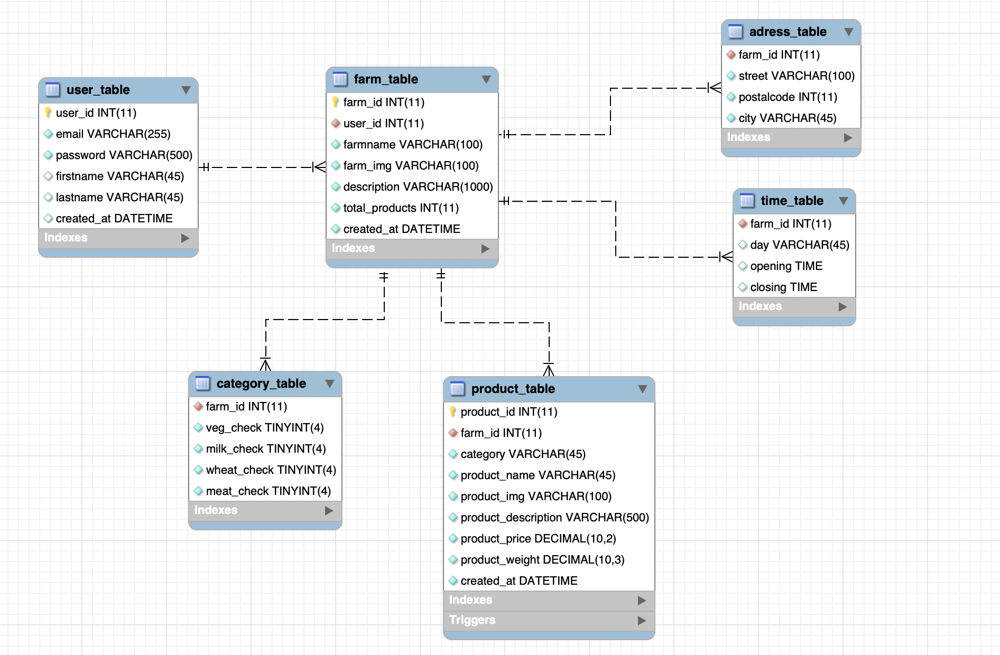

# DaLokal Website

## Desription

DaLokal is a project to connect customer with farms nearby. The user is able to see which farm is selling which goods,what categories, what the farm is about (description), where the farm can be find (adress) and at which time the farm is open.
Every farmer can sign up and can edited his farm every time. The farmer can give a description about his or her farm can give it opening and closing times and can add or delete products and more. 

### ER Diagram

Every user and every user data is connected to the database of MySQL.
